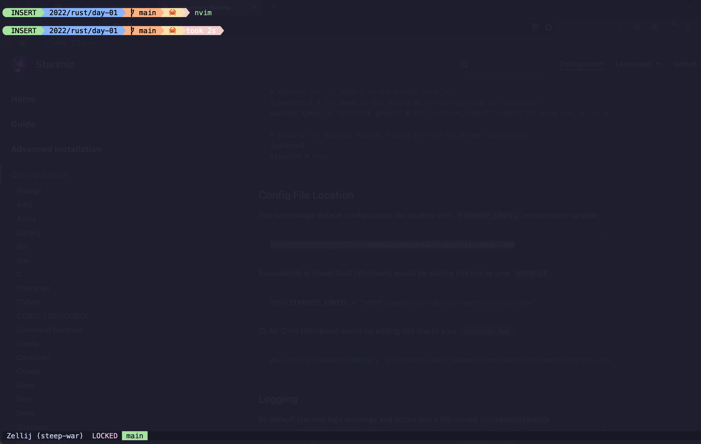

<br/><br/>

# Description

Custom <a href="https://github.com/catppuccin/catppuccin">Catppuccin</a> Themed <a href="https://starship.rs/)">Starship</a> Configuration.

## Status

- [ ] _in progress_
- [x] _finished_
- [ ] _no longer continued_

## Table of contents

- [Description](#description)
- [Status](#status)
- [Table of contents](#table-of-contents)
- [General Info](#general-info)
- [Screenshots](#screenshots)
- [Credits](#credits)

## General Info

plugins see startship.toml

```
$character\
$directory\
$git_branch\
$git_status\
$git_metrics\
$c\
$cmake\
$container\
$dart\
$deno\
$dotnet\
$golang\
$java\
$kotlin\
$kubernetes\
$lua\
$nodejs\
$php\
$python\
$rust\
$cmd_duration\
$docker_context\
```

## Screenshots

<>

## Technologies

Starship.rs (https://starship.rs)

## Setup

https://starship.rs/guide/#%F0%9F%9A%80-installation and copy the starship.toml in your setup.

## Known Issues / Missing Features

---

## Credits:

Based on Pastel Powerline Preset: https://starship.rs/presets/pastel-powerline.html
